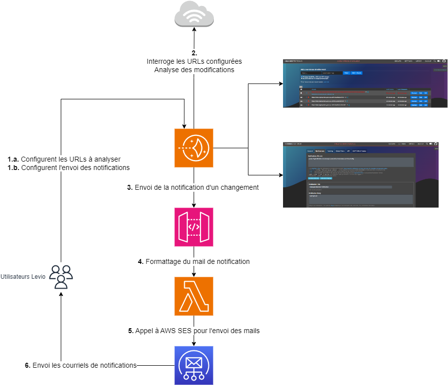

# RSDE-SMSI-Veille-Reglementaire
## Description

Ce projet utilise une instance Lightsail sur AWS pour exécuter un service spécifique installé à l'aide d'un script appelé `setup.sh`.

## Prérequis

Avant de commencer, assurez-vous de disposer des éléments suivants :

1. **Compte AWS Root :** Assurez-vous d'avoir un compte AWS Root configuré. Si vous n'avez pas encore de compte AWS, suivez les étapes ci-dessous pour en créer un.

    - Visitez le site [AWS](https://aws.amazon.com/).
    - Cliquez sur "Créer un compte AWS".
    - Suivez les instructions pour créer votre compte.

2. **Compte Terraform Provisionner :** Vous aurez besoin d'un compte AWS distinct configuré pour être utilisé par Terraform aux fins de provisionnement. Assurez-vous de configurer les clés d'accès appropriées pour ce compte.

3. **Paire de clés Lightsail :** L'administrateur peut télécharger la paire de clés par défaut de Lightsail pour sécuriser l'accès à l'instance et exécuter le script `setup.sh`.

## Configuration de votre compte AWS Root

1. Connectez-vous à votre [Console AWS](https://aws.amazon.com/).
2. Accédez à la section **IAM** (Identity and Access Management).
3. Créez un utilisateur IAM avec des autorisations adéquates pour le provisionnement via Terraform. Notez les clés d'accès générées pour cet utilisateur.

## Configuration du compte Terraform Provisionner

Assurez-vous d'avoir installé Terraform sur votre machine locale. Suivez les étapes ci-dessous pour configurer Terraform avec les clés d'accès de votre compte provisionneur.

1. Installez Terraform en suivant les instructions fournies sur le site officiel de [Terraform](https://www.terraform.io/downloads.html).
2. Créez un fichier `terraform.tfvars` à la racine du projet avec les informations suivantes :

    ```hcl
    aws_access_key = "VOTRE_ACCESS_KEY"
    aws_secret_key = "VOTRE_SECRET_KEY"
    ```

    Remplacez `"VOTRE_ACCESS_KEY"` et `"VOTRE_SECRET_KEY"` par les clés d'accès de votre compte Terraform provisionneur.

## Provisionnement avec Terraform
Utilisez Terraform pour provisionner les ressources nécessaires.
Accédez au répertoire terraform du projet.
Exécutez les commandes Terraform suivantes :

```bash
Copy code
terraform init
terraform apply
```

Suivez les instructions pour confirmer le provisionnement des ressources.

## Configuration de l'instance Lightsail

1. Téléchargez la paire de clés par défaut de Lightsail (key.pem et key.pub) depuis la console Lightsail.
2. Utilisez la paire de clés téléchargée pour vous connecter à votre instance Lightsail.
3. Exécutez le script `setup.sh` sur votre instance Lightsail pour installer et configurer le service nécessaire.

    ```bash
    ./setup.sh
    ```

4. Suivez les instructions fournies par le script pour finaliser la configuration du service.

## Contact

à définir

---

**Note :** Assurez-vous de suivre les meilleures pratiques en matière de sécurité et de gestion des clés d'accès AWS. Ne partagez jamais vos informations d'identification de manière non sécurisée.

## Fonctionnement de l'Infrastructure

L'infrastructure de ce projet fonctionne de la manière suivante :

1. **Connexion des Utilisateurs :**
   - Les utilisateurs utilisent l'adresse IP de l'instance Lightsail pour se connecter au service de détection de changements (`changedetection`).
   - Ils configurent la liste des adresses à analyser via cette interface.

2. **Configuration des Notifications :**
   - Les utilisateurs configurent l'envoi de notifications en spécifiant l'adresse de l'API Gateway et le corps du mail à recevoir en cas de modification détectée.

3. **Analyse des Changements :**
   - Le service (`changedetection`) parcourt les adresses configurées et analyse les modifications au fil du temps.

4. **Notification des Changements :**
   - Lorsqu'une modification est détectée, le service utilise l'adresse de l'API Gateway pour envoyer un message de notification.

5. **Transmission à AWS Lambda :**
   - L'API Gateway reçoit le message de notification et le transmet à une fonction AWS Lambda.

6. **Formatage et Envoi de Mails :**
   - La Lambda formate le message pour en faire un courriel.
   - Ensuite, elle appelle le service d'envoi de mails d'AWS (SES) pour envoyer les courriels aux destinataires configurés.
   - La provision de la liste des destinataires doit être réfléchie pour assurer un envoi efficace des notifications.

7. **Réception des Courriels :**
   - Les courriels sont envoyés à la liste de destinataires configurés, les informant des changements détectés dans les adresses spécifiées.



Cette architecture permet une surveillance efficace des adresses configurées, avec des notifications en temps réel en cas de modifications, offrant ainsi une solution robuste de détection et de suivi des changements.

# Configuration de l'Infrastructure - Checklist

Avant de considérer que l'infrastructure est correctement configurée, assurez-vous de suivre les étapes ci-dessous :

1. **Instance Lightsail :**
   - Vérifiez que l'instance Lightsail est déployée avec succès.
   - Assurez-vous que le script de setup (`setup.sh`) a été exécuté avec succès sur l'instance.
   - Testez la connexion à l'instance en utilisant l'adresse IP publique. Utilisez la commande suivante : `ssh -i /path/to/key.pem ec2-user@instance_ip` (remplacez `/path/to/key.pem` par le chemin de votre clé privée et `instance_ip` par l'adresse IP de l'instance).

2. **API Gateway :**
   - Assurez-vous que l'API Gateway est accessible avec l'URL d'invocation contenu dans les outputs du plan terraform (ou rouler la commande terraform output).

3. **AWS SES :**
   - Vérifiez que la Lambda a accès à AWS SES.
   - Assurez-vous que les informations nécessaires, telles que l'adresse email source (SES_FROM_EMAIL) ainsi que les destination, sont correctement configurées dans les variables d'environnement de la Lambda.
   - Exécutez la Lambda et vérifiez les journaux pour vous assurer qu'elle peut envoyer des emails via SES.

**Notes :**
   - Assurez-vous de documenter toutes les informations nécessaires, telles que les URL, les clés d'accès, et les chemins de fichiers pour assurer la maintenance future.

Avec cette checklist, vous pouvez vous assurer que les composants clés de votre infrastructure sont correctement configurés et prêts à être utilisés.